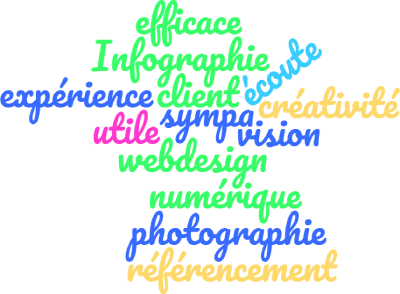

<!-- Main -->

<!-- One -->
<section id="one">
	

<!-- Content -->

	<h3>20 ans d'expérience en informatique</h3>
	
Je suis développeur Web en Freelance avec 20 ans d’expérience en développement, maintenance informatique et gestion de projet.
		
	
Je suis passionné de nature, sport, bricolage, programmation et de photographie.

	<h3>Thomas Juton</h3>
	

<!-- 

 -->

			

				
			

		
		

			<h3>Répondre à vos besoins et ceux de vos clients</h3>
			
L’objectif de la Toile Numérique : répondre aux besoins concrets des entreprises, commerces, artisans et valoriser leur savoir-faire.

			
Mon souhait c'est de vous accompagner avec simplicité et bienveillance dans l’univers numérique.

			
Sans oublier le sens premier de toute technologie : rendre un vrai service aux femmes et aux hommes qui l’utilise.

		

<a href="#contact" class="button next scrolly">Un projet Contactez-moi !</a>

	<h4>Les <i class="fa fa-plus-circle fa-2x"></i> de la Toile Numérique</h4>
	<ul class="alt">
		<li>Recherche de l’efficacité et simplicité</li>
		<li>Etude des profils utilisateurs</li>
		<li>Vulgarisation et simplification</li>
		<li>Photographies</li>
	</ul>

