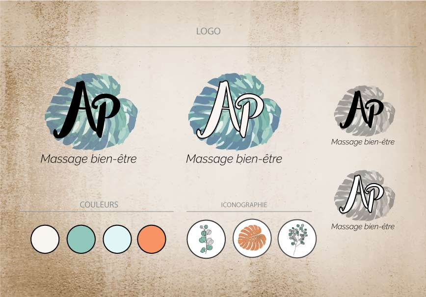

<!-- Main -->

<!-- One -->
<section id="one" class="spotlights">
	<section>
		
		

			

				<header class="major">
					<h3><i class="fa fa-magic fa-2x"></i> Conception et Création de site Internet</h3>
				</header>
				
La Toile Numérique est spécialisée dans la <b>conception et refonte de site Web</b> pour les TPE, PME, commerçants, artisans et associations.

				
J'étudirais avec vous votre métier, votre savoir-faire et votre univers pour concevoir un site Web à votre image en prenant en compte vos besoins spécifiques.

				
				<ul class="actions">
					<li><a href="creationsite.html" class="button">Découvrir l'offre</a></li>
				</ul>
			

		

	</section>
	<section>
		
		

			

				<header class="major">
					<h3><i class="fa fa-search-plus fa-2x"></i> Référencement naturel</h3>
				</header>
				
La visibilité de votre site sur le web dépend de son référencement (indexation) par les moteurs de recherche et de sa présence sur les réseaux sociaux.

				
Je travaillerais avec vous pour définir la stratégie de <b>«référencement naturel»</b> qui correspond à votre cible clients.

				<ul class="actions">
					<li><a href="referencement.html" class="button">Découvrir l'offre</a></li>
				</ul>
			

		

	</section>
	<section>
		
		

			

				<header class="major">
					<h3><i class="fa fa-paint-brush fa-2x"></i> Création de votre identité visuelle</h3>
				</header>
				
La Toile Numérique propose un <b>service de création d’identité visuelle</b> pour promouvoir votre activité et votre savoir-faire.

				
Cette identité visuelle pourra servir comme charte graphique pour l'élaboration de votre site web et vous permettra également de disposer de documents numériques : logo, typographie, photos pour réaliser d’autres supports de communication : impression, réseaux sociaux, etc.

				<ul class="actions">
					<li><a href="identitevisuelle.html" class="button">Découvrir l'offre</a></li>
				</ul>
			

		

	</section>
	<section>
		<a href="creationcontenu.html" class="image">
		<iframe id="inlineFrameExample"
			title="animation la toile numerique"
			width="300"
			height="300"
			src="/Animation_logo/index.html"> 
		</iframe>
		</a>
		

			

				<header class="major">
					<h3><i class="fa fa-camera fa-2x"></i> Création de contenu Photos & Animations</h3>
				</header>
				
Réalisation de <b>photographies, animations graphiques et infographie</b> pour personnaliser votre site internet ou vos réseaux sociaux, publicités ou autres évènements promotionnels.

				
Je dispose d'un matériel photographique professionnel.

				<ul class="actions">
					<li><a href="creationcontenu.html" class="button">Découvrir l'offre</a></li>
				</ul>
			

		

	</section>		
	<section>
		
		

			

				<header class="major">
					<h3><i class="fa fa-user-plus fa-2x"></i> Formation et Conseils informatiques</h3>
				</header>
				
20 ans d'expérience en informatique (maintenance, développement et gestion de projet), la Toile Numérique vous accompagne dans l’utilisation de l'outil numérique.

				
Je vous propose une <b>formation « backoffice »</b> pour une autonomie d'utilisation.

				<ul class="actions">
					<li><a href="formation.html" class="button">Découvrir l'offre</a></li>
				</ul>
			

		

	</section>
	<section>
		
		

			

				<header class="major">
					<h3><i class="fa fa-lock fa-2x"></i> Maintenance de votre site web et Mise à jour de votre actualité</h3>
				</header>
				
Afin de rendre durable votre site web et son <b>référencement au fil du temps</b>, je réalise la <b>maintenance et les mises à jour de sécurité</b> ainsi que la continuité de référencement nécessaire.

				
Votre activité vous prend tout votre temps, je prends en charge la <b>diffusion de vos actualités</b>: votre site web reste <b>attractif et fréquenté</b>.

				<ul class="actions">
					<li><a href="maintenance.html" class="button">Découvrir l'offre</a></li>
				</ul>
			

		

	</section>	
</section>

	<!-- Two -->
	<section id="two">
		

			<header class="major">
				<h2>Vous avez un projet ?</h2>
			</header>
			
Décrivez le avec vos mots à vous et demandez moi un devis.

			<ul class="actions">
				<li><a href="#contact" class="button next" onclick="DemanderDevis()">Demander un devis</a></li>			
			</ul>
		

	</section>

