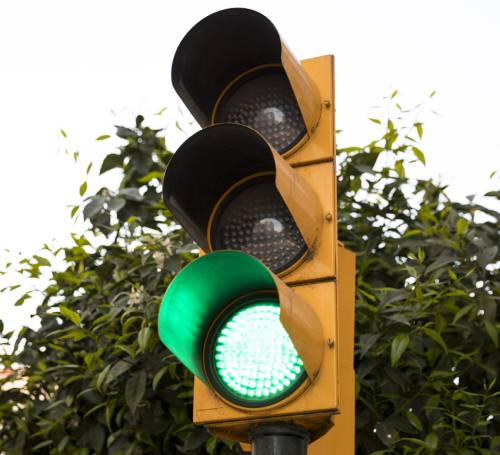

<!-- Content -->
<h2>Bienvenue dans l’aventure !</h2>

Tout commence souvent par cette phrase <b>« je veux un site internet »</b>.

Découvrez à partir de cette simple phrase, le <b>processus & ma méthode de travail</b> pour aboutir à la <b>création de votre site Internet</b>.

<h4><i class="fa fa-cubes fa-2x"></i> Etapes de contruction de votre projet de site web</h4>

	

		<ol>
			<li><a href="#rencontre">Rencontre et découverte de votre activité</a></li>
			<li><a href="#etude">Etude de votre projet</a></li>
			<li><a href="#contenu">Elaboration du contenu</a></li>
			<li><a href="#developpement">Développement et intégration du contenu</a></li>
		</ol>
	

	

		<ol>
			<li><a href="#referencement">Etude du référencement</a></li>
			<li><a href="#inauguration">Mise en ligne de votre site</a></li>
			<li><a href="#maintenance">Assistance et maintenance</a></li>
		</ol>
	

<section id="rencontre" class="spotlights">
	<section >
		

			
		

		

			

				<header class="major">
					<h3 name="rencontre"><i class="fa fa-slideshare fa-2x"></i> Rencontre et découverte de votre activité</h3>
				</header>
				
La première étape : <b>Se rencontrer</b> pour échanger sur votre projet, <b>étudier vos besoins</b> et découvrir votre <b>activité et votre savoir-faire</b>.

				
Je vous présenterai les différents éléments que constituent un site internet ainsi qu’une <b>vulgarisation</b> des termes informatiques pour les néophytes.

				
A l’issue de cette rencontre je rédigerai :

				<ul>
					<li><b>1 cahier des charges</b> de vos premiers besoins.</li>
					<li><b>1 devis</b> avec les options choisies</li>
				</ul>
			

		

	</section>

	<section id="etude">
		

			
		

		

			

				<header class="major">
					<h3><i class="fa fa-lightbulb-o fa-2x"></i> Etude de votre projet</h3>
				</header>
				
Après acceptation du devis, nous passerons à l’action!

				<ul>
					<li>Etude de votre savoir-faire afin de définir <b>l'architecture</b> de votre site web.</li>
					<li>Elaboration du <b>Design</b> avec votre validation.</li>					
					<li>Etude de vos clients et de leur besoins avec la méthode des <b>"personae" : profil de clients type</b>.</li>
				</ul>
				
Dans ma méthode de travail j’accorde une <b>grande importance</b> à la place de <b>vos clients</b> et donc aux utilisateurs finaux.

				
Un formulaire vous sera envoyé pour recueillir les informations importantes de l'étude : nom de domaine, mots clés, connaissance de vos clients, zone de chalandise, etc….

			

		

	</section>
	<section id="contenu">
		

			
		

		

			

				<header class="major">
					<h3><i class="fa fa-camera fa-2x"></i> Elaboration du contenu</h3>
				</header>
				
Une fois les limites et enjeux de votre projet bien établis, vous me ferez parvenir vos contenus textes sous forme d’un simple document texte.

				<ul>
					<li>Définition du <b>texte et rubriques/menus de naviguation</b>.</li>
					<li>Création de la <b>charte graphique (identité visuelle)</b> : couleurs, intégration logo, iconographie en collaboration avec vous : par e-mail, Visio ou téléphone.</li>
					<li>Réalisation des <b>photos d'illustrations</b> : mise en situation, photos de vos équipes, de vos produits, de vos locaux...</li>
				</ul>
			

		

	</section>
	<section id="developpement">
		

			
		

		

			

				<header class="major">
					<h3><i class="fa fa-file-code-o fa-2x"></i> Développement et intégration du contenu</h3>
				</header>
				
La phase de développement du site et l'intégration du contenu pourra débuter.

				
Suivi de l'avancée du developpement via un lien online.

				
A la fin du processus de developpement : des tests et une relecture complète.

			

		

	</section>	
	<section id="referencement">
		

			
		

		

			

				<header class="major">
					<h3><i class="fa fa-search-plus fa-2x"></i> Référencement</h3>
				</header>
				
Le <b>référencement et l'indexation</b> de votre site sera réalisé après étude de vos réponses au <b>formulaire de recueils d’informations</b>.

				
Il sera affiné suivant la méthode des personae, la bonne connaissance de vos clients ou futurs clients.

				
La Toile Numérique validera avec vous <b>la bonne stratégie</b> pour être présent sur les <b>réseaux sociaux</b>.

			

		

	</section>	
	<section id="inauguration">
		

			
		

		

			

				<header class="major">
					<h3><i class="fa fa-flash fa-2x"></i> Mise en ligne de votre site</h3>
				</header>
				
Nous réaliserons ensemble la mise en ligne de votre site définitif.

				
Je vous fournirai l’ensemble des informations nécessaires pour <b>une bonne prise en main de votre site</b>.

				
Une <b>formation</b> pourra vous être proposée pour <b>être autonome</b> dans l’ajout, la modification des textes et photos de votre site web.

				
<i class="fa fa-thumbs-up fa-2x"></i>Sachez qu'avec la Toile numérique vous <b>restez propriétaire de votre nom de domaine</b>.

			

		

	</section>		
	<section id="maintenance">
		

			
		

		

			

				<header class="major">
					<h3><i class="fa fa-wrench fa-2x"></i>Assistance & Maintenance</h3>
				</header>
				
Vous disposerez d'une <b>période de maintenance de 2 mois offerte</b> après la mise en ligne de votre site.

				
A l'issue des 2 premiers mois, il est <b>fortement recommandé</b> de souscrire <b>un forfait de maintenance</b> pour les mises à jour de sécurité.
		

			

		

	</section>			
</section>

<!-- Two -->
<section id="two">
	

		<header class="major">
			<h2>Découvrez les services de la Toile Numérique</h2>
		</header>
		<ul class="actions">
			<li><a href="2-services-creation-site_internet-web-referencement-savenay-44260.html" class="button next" >Services et produits</a></li>			
		</ul>
	

</section>

